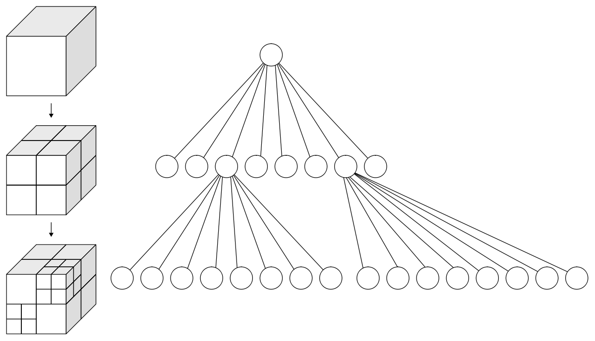

---
title:
    Realtime Path Tracing on the GPU
subtitle:
    The Octree Data Structure
date:
    2020-03-25
author:
    Christofer Nolander
---

In the previous post we introduced the concepts of path tracing and how to make
it fast enough to run in real-time. As stated in that post, we will now look at
how an *octree* will help us to reduce the cost of tracing a ray in the scene.

# A Three-D Tree

If you've taken a class in datastructures you are probably familiar with the
concept of a tree: a parent node with some number of children nodes, each of
which is also a tree. An octree is also a tree, but with the special property
that every parent has exactly eight children, or "octants" (hence the name
*oct*-tree, from *octo*, meaning eight). Every node in an octree represents a
cube in 3D space, where the eight children are a subdivision of the parent cube.
See this illustrative image:

There are analogs of *octree*s in other dimensions, such as a quadtree in 2D.
Since it's hard to show in pictures how an octree works, since its in 3D,
everything below will be of quadtrees.

A common usecase for octrees is to quickly be able to determine what objects are
at a given position. In this case, the root node of the octree should contain
all the objects in the scene. For our given query-point we would then check
which child of the root we are in, and then recursively traverse down that child
until we hit some leaf node, which either contains some object or is empty.

# Tracing Rays in an Octree

Octrees turn out to be really helpful when tracing a scene. If we were to trace
a ray in the scene above, we are only interested in the nodes of the octree the
ray intersects. Therefore, we may recursively, starting from the root, check
which children of the tree the ray intersects. We may then recursively check
every child's children for intersections, and so on. Additionally, if a child
happens to not have any children of its own, and isn't a leaf, we may skip that
one as well since we know the ray cannot intersect anything.

That last point happens to be very important since, in many scenes, there's a lot of
empty space. Because of this rays don't often have to traverse the entire tree
all the way down to the leaves. Instead they can skip many of the children,
resulting very cheap traversal.

For simplicity, the path tracer developed here will only have one type of
objects in the scene: cubes (can you guess why?). The cubes will be aligned on
a grid. Similar to the mining-crafting game Minecraft. In the next post we will
implement the octree and finally start rendering some cubes!

<a href="2020-03-24-intro.html" style="float:left;">Previous Post</a>
<a href="2020-03-26-ray-tracing.html" style="float:right;">Next Post</a>

